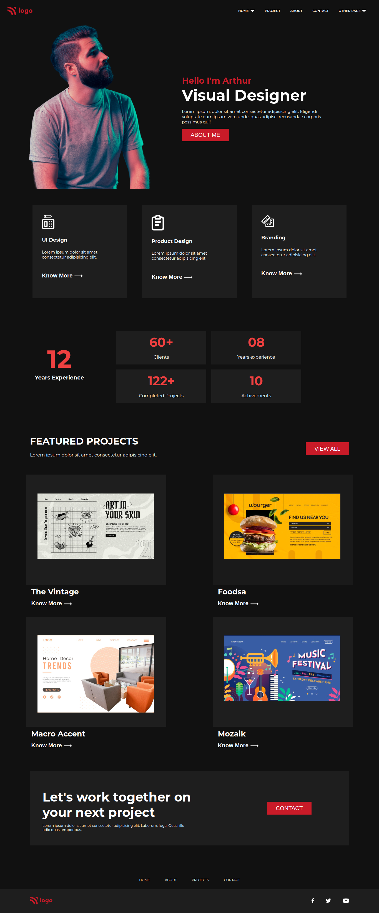

# Developers Portfolio page

This is my **first React Project**. I have built this [same webpage](https://github.com/Sduttt/project15) using core HTML CSS and here I have cloned that using React. This project helped me to learn this things:
- Creating a React App from scratch
- Using props
- Creating and using reusable components
- Getting familiar with React environment

You can find the live project [here](https://firstreactapp-subham.netlify.app/)

## Contact me: [Linkedin](https://www.linkedin.com/in/subham-dutta-8670b8178/) | [Github](https://github.com/Sduttt) | [Twitter](https://twitter.com/Subhamd88404337) | [Facebook](https://www.facebook.com/profile.php?id=100073951804006) | [Instagram](https://www.instagram.com/its_subham_dutta/)